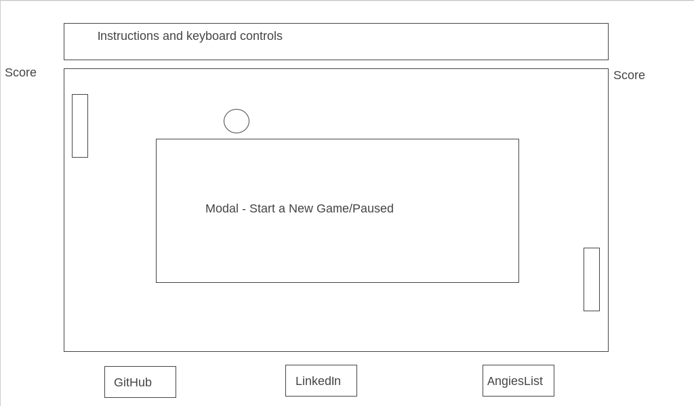

## JS Project Proposal: Pong

### Background

The rules of the game are simple. Protect your zone. 2 paddles, one ball. If it goes "out of bounds", the other team scores a point.

### Functionality & MVP  

The fully completed project should include the following features:

- [ ] Start, pause, and reset the game
- [ ] Move paddles vertically without lag
- [ ] Compete against an computer AI

in addition, this project will include:

- [ ] a modal on boot and when the game is paused
- [ ] a production README

This app will consist of a single screen with game board and nav links to Github, LinkedIn and AngiesList. Above the game, there will be instructions to start a new game, pause a game, or reset a game.

### Architecture and Technologies

- JavaScript for game logic,
- jQuery for rendering the game instructions and modal
- Canvas for rendering the board and animations

**Day 1**:
  Setup all necessary Node modules, including getting webpack up and running and canvas installed. Write a basic entry file and the bare bones of all 3 scripts outlined above. Become comfortable with canvas.  Goals for the day:

  - build out the complete board, with ball, boards and paddles

**Day 2**
  Dedicate the day to becoming comfortable with canvas.
  Goals for the day:

  - Write out the logic for the ball's path trajectory and velocity.
  - Add logic to keep track of score and end the game when a player reaches 10.

**Day 3**
  Create basic computer AI logic.
  Goals for the day:
  - Ensure that computer AI's movements are bug-free and smooth.

**Day 4**
  Install controls so that a user can interact with the game.

  Goals for the Day:
  - Ensure that the game runs smoothly and that all logic is sound
  - Style the board, paddles, ball, instructions, modal, and links.
  - Add sound integration to game  

  ### Bonus features
  - [ ] Add an option to toggle Difficulty, including board size, paddle size, ball speed, AI intelligence, etc.
  - [ ] Add multiplayer functionality.
